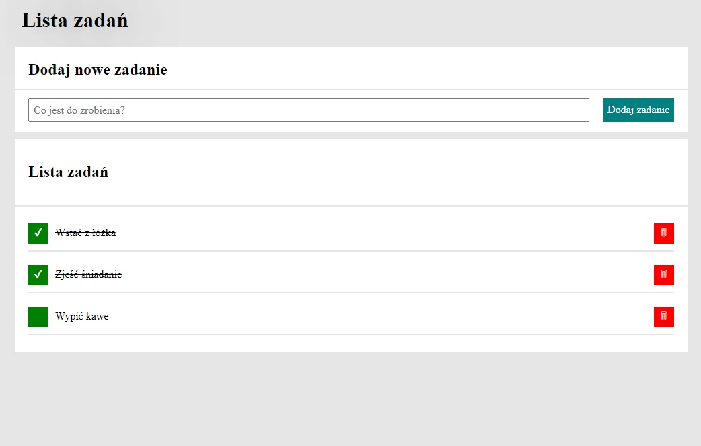
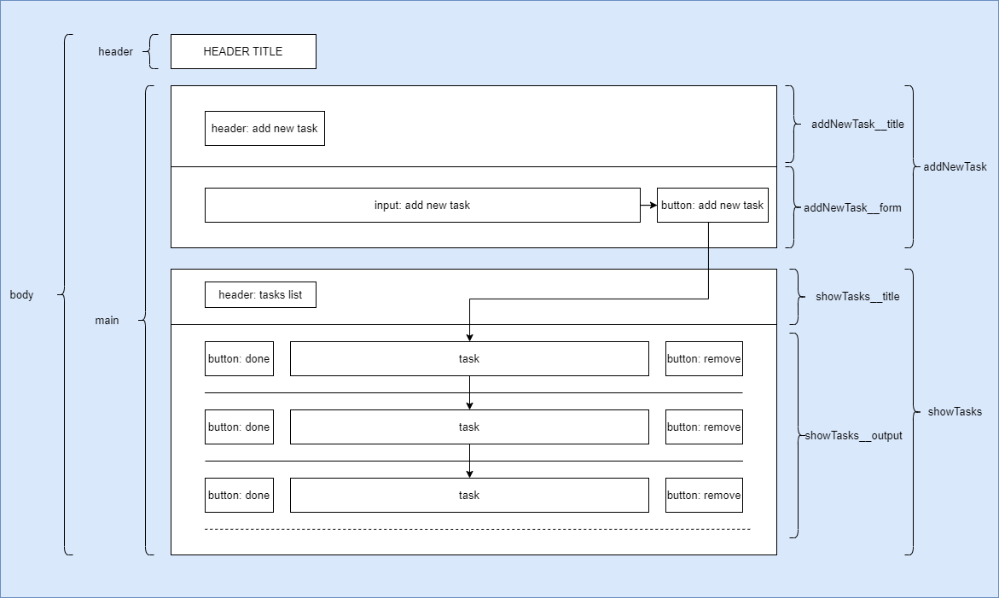

# LIST TO DO

- [LIST TO DO](#list-to-do)
  - [Introduction](#introduction)
  - [Application build](#application-build)
  - [Technology used](#technology-used)

## Introduction

This simple application letting us to plan our to do list. In order to add a new task, type it inside input line and then press add new task button. Each new task will be added to the end of task list and so on. You can manage each of them by pressing green square button to mark task is done or even remove it by press red square button.

## Application build

In the `<body>` block we can find 2 blocks of code. First one is title application `<header>`, second main application code named `<main>`. `<main>` uses **display: grid** which contains 2 sections of blocks: `<addNewTask>` where accept input data and send it to another block named `<showTasks>`. These 2 blocks are build in **display: grid** too. Inside both of them we can see headers: `<addNewTask__title>` and `<showTasks__title>`. To present possibilities of **display: flex** it has been used in `<addNewTask__form>` and `<showTasks__output>`, they are used in order to collect data and send them to the screen.

## Technology used

- HTML
- CSS
- JAVASCRIPT ES6+
- BEM CONVENTION
- GRID
- FLEX
- MEDIA QUERY